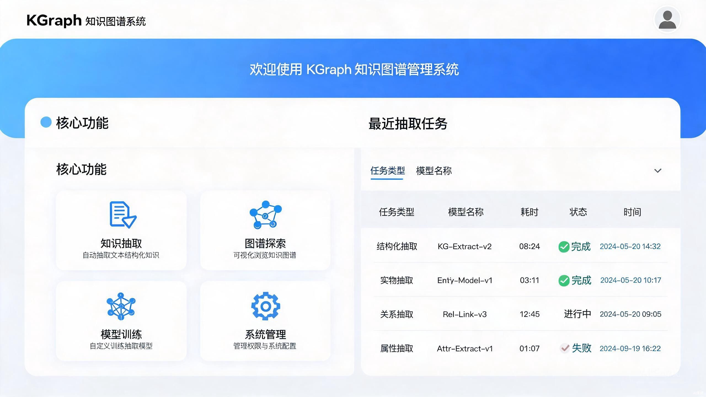
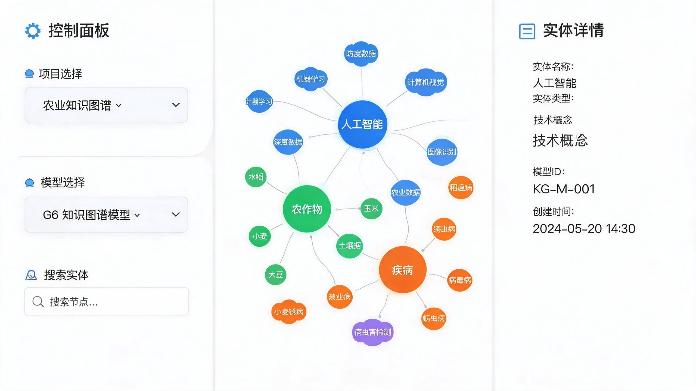
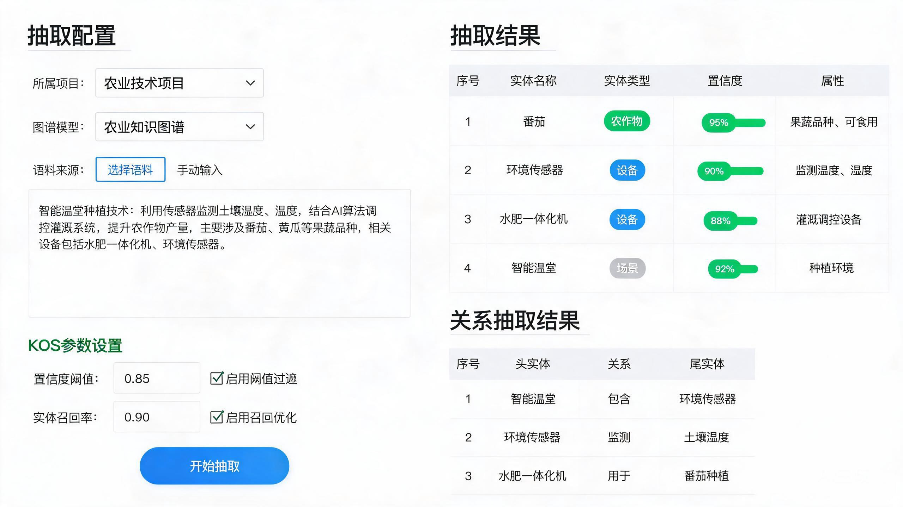
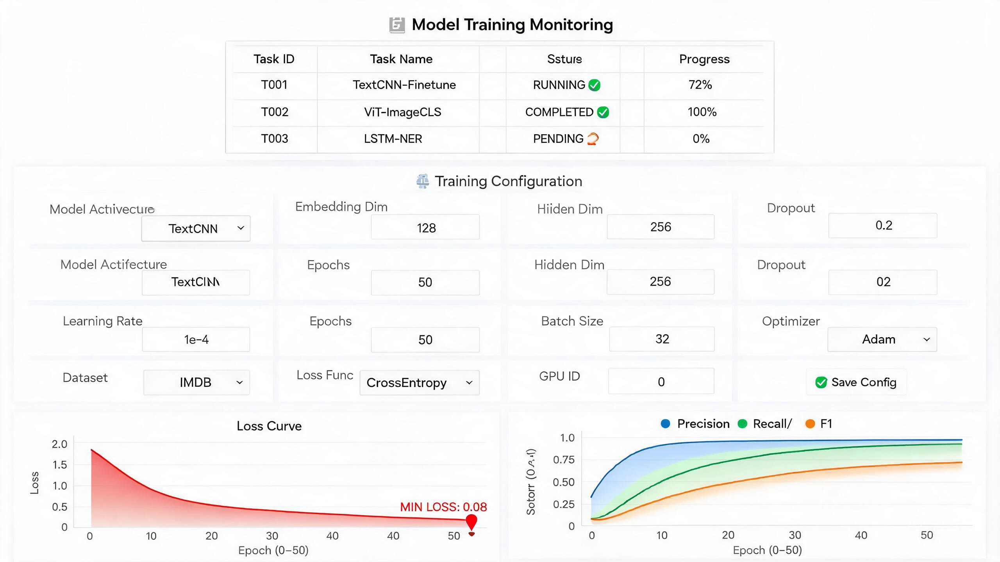

# KGraph 知识图谱管理系统

> 基于 Vue 3 + Spring Boot + FastAPI 的全栈知识图谱构建与管理平台，支持结构化抽取、KOS 抽取、深度学习抽取、LLM 抽取四种知识抽取方式，集成 Neo4j 图数据库与 G6 可视化。

---

## 系统截图

### 首页 Dashboard



### 图谱探索



### 知识抽取



### 模型训练



---

## 项目简介

KGraph 是一个面向知识图谱构建与管理的全栈系统，覆盖从知识抽取、本体建模、图谱可视化到模型训练的完整链路。系统采用三层混合架构：

| 层级 | 技术栈 | 职责 |
|------|--------|------|
| 前端 | Vue 3 + Element Plus + Vite + TypeScript | UI 交互、图可视化（G6）、图表展示（ECharts） |
| Java 主服务 | Spring Boot + MyBatis-Plus + MySQL + Neo4j + MinIO | 业务编排、权限管理、结构化抽取、图谱 CRUD |
| Python 微服务 | FastAPI + OpenAI SDK | LLM 抽取、KOS 抽取、深度学习抽取、模型训练 |

### 核心功能

- **项目管理**：多项目隔离，每个项目可创建多个图谱模型
- **本体建模**：自定义实体类型、关系类型、属性，支持多模型 schema 隔离
- **知识抽取**（四种方式）：
  - 结构化抽取：Excel/CSV 字段映射
  - KOS 抽取：领域词表 + TF-IDF 统计 + 三层结构（范畴→概念→术语）
  - 深度学习抽取：词典匹配 + CRF 约束 + 规则细分（22 种实体类型）
  - LLM 抽取：Prompt 工程 + 大模型 API
- **图谱探索**：G6 交互式可视化，节点拖拽/缩放/属性查看
- **实体关系管理**：CRUD 操作，分页展示
- **模型训练**：训练任务管理、曲线监控、模型效果评估
- **数据标注**：标注任务管理，支持 BIO 标签体系
- **智能问答**：基于 Spring AI 的对话式知识查询

---

## 技术栈

### 前端

- Vue 3（Composition API）
- Element Plus
- Vite + TypeScript
- AntV G6（图可视化）
- ECharts（训练曲线/指标图表）
- Pinia（状态管理）
- Axios（HTTP 请求）

### Java 主服务

- Spring Boot 3
- MyBatis-Plus
- MySQL 8
- Neo4j 5
- MinIO（对象存储）
- Spring AI（LLM 集成）
- Knife4j（API 文档）

### Python 微服务

- FastAPI
- OpenAI Python SDK
- Neo4j Python Driver

---

## 项目结构

```
KGraph/
├── frontend/                    # 前端
│   ├── src/
│   │   ├── api/                 # API 封装
│   │   ├── components/          # 通用组件
│   │   │   ├── dl/              # 深度学习模块组件
│   │   │   └── ExtractionLayout.vue
│   │   ├── layouts/             # 布局组件
│   │   ├── router/              # 路由配置
│   │   ├── stores/              # Pinia 状态管理
│   │   └── views/               # 页面
│   │       ├── platform/        # 平台管理
│   │       ├── Home.vue         # 首页
│   │       ├── Explore.vue      # 图谱探索
│   │       ├── Extraction.vue   # LLM 抽取
│   │       ├── KosExtraction.vue# KOS 抽取
│   │       ├── DlExtraction.vue # 深度学习抽取
│   │       ├── StructureExtraction.vue
│   │       ├── Corpus.vue       # 语料管理
│   │       ├── Model.vue        # 模型管理
│   │       └── Project.vue      # 项目管理
│   └── package.json
│
├── src/main/java/.../seedboot/  # Java 主服务
│   ├── annotation/              # 权限注解
│   ├── aop/                     # AOP 切面
│   ├── config/                  # 配置类
│   ├── controller/              # 控制器
│   ├── mapper/                  # MyBatis Mapper
│   ├── model/                   # 数据模型
│   │   ├── entity/              # 实体类
│   │   ├── request/             # 请求对象
│   │   └── vo/                  # 视图对象
│   ├── service/                 # 业务逻辑
│   │   └── Impl/                # 实现类
│   └── SeedBootApplication.java
│
├── pybackend/                   # Python 微服务
│   ├── api/                     # FastAPI 路由
│   ├── core/                    # 核心算法
│   │   ├── llm_client.py        # LLM 调用封装
│   │   ├── prompt_builder.py    # Prompt 构造
│   │   ├── kos_extractor.py     # KOS 抽取
│   │   ├── dl_extractor.py      # 深度学习抽取
│   │   ├── trainer.py           # 模型训练
│   │   └── graph_writer.py      # Neo4j 写入
│   ├── models/                  # Pydantic 模型
│   ├── text_processor/          # 文本处理工具
│   ├── config.example.json      # 配置模板
│   ├── main.py                  # FastAPI 入口
│   └── requirements.txt
│
├── sql/                         # 数据库脚本
│   ├── kgraph.sql               # 主业务表
│   ├── graph.sql                # 图谱相关表
│   ├── user.sql                 # 用户表
│   ├── chat_history.sql         # 聊天记录表
│   └── log.sql                  # 日志表
│
└── pom.xml                      # Maven 配置
```

---

## 快速开始

### 环境要求

- JDK 17+
- Node.js 18+
- Python 3.10+
- MySQL 8+
- Neo4j 5+
- Redis 7+
- MinIO

### 1. 克隆项目

```bash
git clone https://github.com/reponsee/KGraph.git
cd KGraph
```

### 2. 初始化数据库

```bash
# 创建 MySQL 数据库
mysql -u root -p -e "CREATE DATABASE seedboot DEFAULT CHARACTER SET utf8mb4;"

# 导入表结构
mysql -u root -p seedboot < sql/kgraph.sql
mysql -u root -p seedboot < sql/user.sql
mysql -u root -p seedboot < sql/chat_history.sql
mysql -u root -p seedboot < sql/log.sql
```

### 3. 配置 Java 主服务

```bash
# 复制配置模板
cp src/main/resources/application-local.example.yml src/main/resources/application-local.yml

# 编辑配置，填入你的数据库、Neo4j、MinIO、LLM API Key
vim src/main/resources/application-local.yml
```

### 4. 启动 Java 主服务

```bash
./mvnw spring-boot:run
```

服务启动在 `http://localhost:8888/api`

### 5. 配置 Python 微服务

```bash
cd pybackend

# 复制配置模板
cp config.example.json config.json

# 编辑配置，填入你的 LLM API Key 和 Neo4j 密码
vim config.json

# 安装依赖
pip install -r requirements.txt
```

### 6. 启动 Python 微服务

```bash
cd pybackend
python main.py
```

服务启动在 `http://localhost:8001`

### 7. 启动前端

```bash
cd frontend
npm install
npm run dev
```

前端启动在 `http://localhost:5173`

---

## 配置说明

> **重要**：以下文件包含敏感信息，已被 `.gitignore` 排除，不会提交到 GitHub：

| 文件 | 说明 | 模板 |
|------|------|------|
| `src/main/resources/application-local.yml` | Java 主服务配置（数据库、Neo4j、MinIO、API Key） | `application-local.example.yml` |
| `pybackend/config.json` | Python 微服务配置（LLM API Key、Neo4j） | `config.example.json` |
| `pybackend/prompt.json` | LLM Prompt 模板 | - |

请复制对应的 `.example` 模板文件并填入你的配置。

---

## 核心功能说明

### 知识抽取

#### 1. 结构化抽取

上传 Excel/CSV 文件，通过字段映射将表格数据直接写入 Neo4j 图谱。支持自定义实体类型、关系类型和属性映射。

#### 2. KOS 抽取

基于内置领域词表（覆盖农业、信息、医学、经济、教育 5 大领域）的三层结构：

```
范畴分类 → 主题概念 → 领域术语
```

- 滑动窗口最长匹配识别术语
- TF-IDF 评分筛选高频术语
- 聚合构建概念和范畴层级
- 支持本体对齐到图谱模型 schema

#### 3. 深度学习抽取

基于词典匹配 + CRF 序列标注的实体识别方法：

- 内置 8 类词典（KOS 术语、人物、机构、期刊、地名等）
- CRF 转移矩阵约束标签合法性
- 规则后处理细分 22 种实体类型（书名号→作品、金额正则→金额等）
- 关系抽取基于实体类型对模板

#### 4. LLM 抽取

基于大语言模型的零样本抽取：

- Prompt 工程构造抽取指令
- 支持自定义实体/关系类型
- JSON 结构化输出解析
- 结果写入 Neo4j

### 图谱探索

- 三栏布局：左侧控制面板、中间 G6 画布、右侧节点详情
- 支持节点拖拽、缩放、框选
- 多模型数据隔离（`modelId` 字段过滤）
- 关系标签使用 `relationType` 字段展示

### 模型训练

- 训练任务管理（创建/选择/停止/完成）
- 训练曲线监控（Loss + P/R/F1 分图展示）
- 模型效果评估（混淆矩阵 + 错误样本分析）
- 任务状态 localStorage 持久化

---

## API 文档

Java 主服务启动后，访问 Knife4j API 文档：

```
http://localhost:8888/api/doc.html
```

Python 微服务启动后，访问 FastAPI 自动文档：

```
http://localhost:8001/docs
```

---

## 关键设计

### Neo4j 多模型隔离

每个图谱模型的实体和关系通过 `modelId` 字段隔离，Cypher 查询时通过 `WHERE n.modelId = $modelId` 过滤。

### 关系类型存储

Neo4j 关系使用固定的 relationship type（`RELATED`），业务关系名存储在 `relationType` 属性中，避免属性覆盖问题。

### 抽取任务记录

所有抽取任务记录到 `extraction_task` 表，包含抽取类型、模型 ID、耗时、状态等信息，支持历史查询。

### 前后端数据格式兼容

前端封装 `extractRecords` 函数，兼容后端返回的 `records` / `list` / 数组等多种格式。

---

## License

MIT
