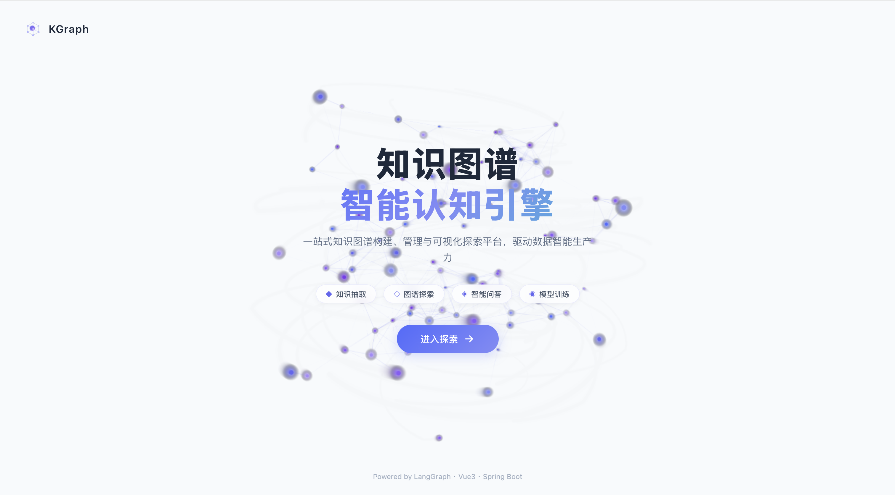
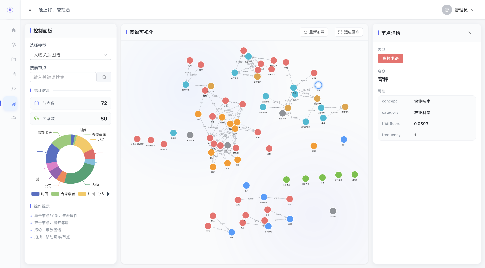
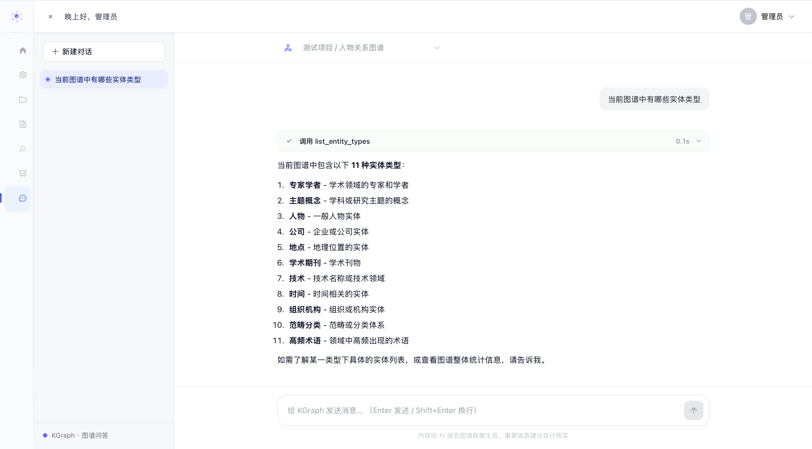

# KGraph 知识图谱管理系统

> 基于 Vue 3 + Spring Boot + FastAPI 的知识图谱构建、管理、训练和问答的一体式平台，支持通过 MinerU 解析 PDF/Word 文档构建语料并提供四种策略的文本切分（防止 LLM 上下文超限），提供结构化抽取、KOS 抽取、深度学习抽取、LLM 抽取四种知识抽取方式，集成 Neo4j 图数据库与 G6 可视化。

---

## 系统截图

### 首页 Dashboard

展示系统总览：项目/模型/实体/抽取任务统计、核心功能矩阵、最近抽取任务列表。


### 图谱探索

基于 AntV G6 的交互式图谱可视化，支持节点拖拽、缩放、双击展开邻居、单击查看属性。三栏布局：左侧控制面板、中间画布、右侧节点详情（点击节点时挤压中间图谱区域，关闭详情恢复原宽）。

### 知识抽取（KOS 抽取）

KOS 抽取页面：左侧配置区（项目/模型选择、语料来源、11 项 KOS 参数）+ 右侧结果区（实体列表、关系列表、历史记录）。


### 深度学习抽取 - 模型训练

模型训练页面：训练任务列表、训练配置表单、训练曲线监控（Loss 曲线 + P/R/F1 曲线分图展示）。


---
### LLM抽取
LLM抽取页面：双 Tab（知识抽取 / 质量评估）。知识抽取含抽取配置（实体关系配置、抽取配置）与结果展示；质量评估支持选择历史抽取结果与语料进行内在指标 + LLM-as-Judge 评估。

### 智能问答（流式输出）

对话式知识查询页面：极简界面布局，支持 LLM 思维链流式展示、工具调用卡片、正式回答逐字打字机效果。基于 LangGraph Agent + 图谱工具（搜索实体、获取详情、关系查询、图谱统计、按类型查询实体等）+ SSE 全链路流式推送。支持会话管理与右下角 LLM 模型选择（DeepSeek 系列，llm_model 表配置）。



## 项目简介

KGraph 是一个面向知识图谱构建、管理、训练和问答的一体式平台，覆盖从知识抽取、本体建模、图谱可视化到模型训练的完整链路。系统采用三层混合架构：

| 层级 | 技术栈 | 职责 |
|------|--------|------|
| 前端 | Vue 3 + Element Plus + Vite + TypeScript + marked（Markdown 渲染） | UI 交互、图可视化（G6）、图表展示（ECharts）、SSE 流式接收 + 打字机动效 |
| Java 主服务 | Spring Boot + MyBatis-Plus + MySQL + Neo4j + MinIO + WebFlux（`Flux<ServerSentEvent>` SSE 代理） | 业务编排、权限管理、结构化抽取、图谱 CRUD、MinerU 文档解析调度、流式事件透传 |
| Python 微服务 | FastAPI + OpenAI SDK + LangGraph（Agent 编排） + `StreamingResponse`（SSE） | LLM 抽取、KOS 抽取、深度学习抽取、模型训练、智能问答 Agent（流式工具调用） |
| 外部服务 | MinerU v3.4.5（文档解析） | PDF/Word → Markdown 转换，独立进程运行 |

### 核心功能

- **项目管理**：多项目隔离，每个项目可创建多个图谱模型
- **本体建模**：自定义实体类型、关系类型、属性，支持多模型 schema 隔离
- **语料管理**（含 MinerU 文档解析 + 文本切分）：
  - 文本输入：手动输入文本内容直接入库
  - 文档上传：PDF/Word 上传到 MinIO，`@Async` 异步调用 MinerU 解析为 Markdown 入库，前端轮询感知解析状态
  - 支持解析失败后重新触发解析
  - **文本切分**：四种策略（定长滑窗 / 句子感知合并 / 递归字符分割 / 结构优先切分），支持预览与执行；切分结果存入 `corpus_chunk` 表，保留原文偏移（`startOffset`/`endOffset`）确保可溯源；编辑语料内容时自动清空失效分块
- **知识抽取**（四种方式）：
  - 结构化抽取：Excel/CSV 字段映射
  - KOS 抽取：领域词表 + TF-IDF 统计 + 三层结构（范畴→概念→术语）
  - 深度学习抽取：词典匹配 + CRF 约束 + 规则细分（22 种实体类型）
  - LLM 抽取：两阶段流水线（Semantica 风格）—— 阶段1 抽节点（实体/事件/指代消解/时间锚点）→ 阶段2 以实体表为硬约束抽关系（附证据句），支持双时态关系（CURRENT/EXPIRED/NEGATED）
- **图谱探索**：G6 交互式可视化，三栏布局，点击节点挤压中间图谱区域展示详情
- **实体关系管理**：CRUD 操作，分页展示
- **模型训练**：训练任务管理、曲线监控、模型效果评估
- **数据标注**：标注任务管理，支持 BIO 标签体系
- **智能问答（LangGraph Agent · SSE 流式）**：基于 LangGraph v2 事件体系编排 Agent，内置 8 个图谱工具（`search_entities`、`get_entity_detail`、`get_entity_relations`、`get_graph_stats`、`list_entity_types`、`get_entities_by_type`、`get_entities_by_name`、`get_causal_chain`）。通过 Python→Java→前端 全链路 SSE 增量推送，配合前端打字机缓冲队列实现：① 思考过程流式展示 ② 工具调用执行状态实时卡片 ③ 正式回答逐字 Markdown 渲染输出
- **智能问答 · 模型选择与会话管理**：
  - 右下角模型选择器（Trae Work 风格）：模型清单由 `llm_model` 表维护（DeepSeek 系列，可扩展千问/GLM），`GET /api/chat/llm-models` 动态拉取；上次选择存 localStorage，首次使用默认 deepseek-chat
  - 图谱模型（顶部下拉）选择持久化 localStorage，刷新/切换菜单后自动恢复
  - 会话管理：新建/切换/删除会话，历史消息 MySQL 持久化 + Redis 缓存（次日 0 点过期）
  - 会话标题：首轮问答完成后异步调用 LLM 生成 ≤20 字标题（不截断），先发 `done` 恢复输入框、再补发 `title` 事件实时替换会话项标题；短路优化 + 规则兜底降级
- **LLM 抽取质量评估**：抽取页"质量评估"Tab，支持从抽取历史选择结果与语料一键评估；内在指标（孤立实体率/平均度/证据覆盖率/低置信率等）+ LLM-as-Judge 抽样评估（G-Eval 风格，三元组忠实度/谓词合理性/双时态正确性/证据句有效性/实体边界正确性）

---

## 技术栈

### 前端

- Vue 3（Composition API）
- Element Plus
- Vite + TypeScript
- AntV G6（图可视化）
- ECharts（训练曲线/指标图表）
- Pinia（状态管理）
- Axios（HTTP 请求）
- marked（Markdown 渲染，智能问答回答展示）

### Java 主服务

- Spring Boot 3
- MyBatis-Plus
- MySQL 8
- Neo4j 5
- MinIO（对象存储）
- Spring WebFlux（`Flux<ServerSentEvent>` SSE 流式代理）
- Knife4j（API 文档）

### Python 微服务

- FastAPI
- OpenAI Python SDK
- Neo4j Python Driver
- LangChain / LangGraph（智能问答 Agent 编排 + 工具调用生命周期事件）
- langchain-openai（ChatOpenAI 流式）

---

## 项目结构

```
KGraph/
├── frontend/                    # 前端
│   ├── src/
│   │   ├── api/                 # API 封装
│   │   ├── components/          # 通用组件
│   │   │   ├── dl/              # 深度学习模块组件
│   │   │   └── ExtractionLayout.vue
│   │   ├── layouts/             # 布局组件
│   │   ├── router/              # 路由配置
│   │   ├── stores/              # Pinia 状态管理
│   │   └── views/               # 页面
│   │       ├── platform/        # 平台管理
│   │       ├── Home.vue         # 首页
│   │       ├── Explore.vue      # 图谱探索
│   │       ├── Chat.vue         # ⭐ 智能问答（流式）
│   │       ├── Extraction.vue   # LLM 抽取
│   │       ├── KosExtraction.vue# KOS 抽取
│   │       ├── DlExtraction.vue # 深度学习抽取
│   │       ├── StructureExtraction.vue
│   │       ├── Corpus.vue       # 语料管理
│   │       ├── Model.vue        # 模型管理
│   │       └── Project.vue      # 项目管理
│   └── package.json
│
├── src/main/java/.../seedboot/  # Java 主服务
│   ├── annotation/              # 权限注解
│   ├── aop/                     # AOP 切面
│   ├── config/                  # 配置类（含 PythonServiceClient、CustomChatMemoryRepository）
│   ├── controller/              # 控制器（含 ChatController 流式路由）
│   ├── mapper/                  # MyBatis Mapper
│   ├── model/                   # 数据模型
│   │   ├── entity/              # 实体类
│   │   ├── request/             # 请求对象
│   │   └── vo/                  # 视图对象
│   ├── service/                 # 业务逻辑（ChatService 返回 Flux<ServerSentEvent>）
│   │   └── Impl/                # 实现类
│   └── SeedBootApplication.java
│
├── pybackend/                   # Python 微服务
│   ├── api/                     # FastAPI 路由
│   │   ├── chat_agent.py        # ⭐ 智能问答 SSE Agent 流式接口
│   │   ├── extraction.py        # LLM 抽取 + 质量评估
│   │   ├── evaluation.py        # 评估端点（内在指标 + LLM-as-Judge）
│   │   └── splitter.py          # ⭐ 文本切分接口（4 策略）
│   ├── core/                    # 核心算法
│   │   ├── agent_tools.py       # ⭐ Agent 图谱工具集（8个工具）
│   │   ├── llm_client.py        # LLM 调用封装
│   │   ├── prompt_builder.py    # Prompt 构造
│   │   ├── kos_extractor.py     # KOS 抽取
│   │   ├── dl_extractor.py      # 深度学习抽取
│   │   ├── trainer.py           # 模型训练
│   │   ├── graph_writer.py      # Neo4j 写入
│   │   └── extraction_validator.py  # 抽取校验 + 后处理补边
│   ├── splitter/                # ⭐ 文本切分策略包
│   │   ├── base.py              # Chunk 数据类 + SplitStrategy 抽象基类
│   │   ├── fixed.py             # 定长滑窗分块
│   │   ├── sentence.py          # 句子感知合并分块
│   │   ├── recursive.py         # 递归字符分割
│   │   ├── structure.py         # 结构优先切分（Markdown/中文标题）
│   │   └── __init__.py          # 策略注册表 STRATEGY_REGISTRY
│   ├── models/                  # Pydantic 模型
│   ├── text_processor/          # 文本处理工具
│   ├── config.example.json      # 配置模板
│   ├── main.py                  # FastAPI 入口
│   └── requirements.txt
│
├── sql/                         # 数据库脚本
│   ├── kgraph.sql               # 主业务表
│   ├── graph.sql                # 图谱相关表
│   ├── user.sql                 # 用户表
│   ├── chat_history.sql         # 对话历史表
│   ├── chat_session.sql         # 会话元数据表（AI 生成标题）
│   ├── llm_model.sql            # LLM 模型配置表（智能问答模型选择）
│   └── log.sql                  # 日志表
│
└── pom.xml                      # Maven 配置
```

---

## 快速开始

### 环境要求

- JDK 17+
- Node.js 18+
- Python 3.10+
- MySQL 8+
- Neo4j 5+
- Redis 7+
- MinIO（语料文件存储）
- MinerU v3.4.5（PDF/Word 文档解析，独立进程）

### 1. 克隆项目

```bash
git clone https://github.com/reponsee/KGraph.git
cd KGraph
```

### 2. 初始化数据库

```bash
# 创建 MySQL 数据库
mysql -u root -p -e "CREATE DATABASE seedboot DEFAULT CHARACTER SET utf8mb4;"

# 导入表结构
mysql -u root -p seedboot < sql/kgraph.sql
mysql -u root -p seedboot < sql/user.sql
mysql -u root -p seedboot < sql/chat_history.sql
mysql -u root -p seedboot < sql/llm_model.sql   # 智能问答模型选择（导入后替换 api_key）
mysql -u root -p seedboot < sql/log.sql

# Neo4j 约束/索引（可选，提升查询性能并保证实体唯一性）
# 将 sql/graph.sql 内容在 Neo4j Browser 中执行
```

### 3. 启动 MinerU 文档解析服务

MinerU 是独立的 Python 进程，提供 `/file_parse` HTTP 接口把 PDF/Word 转换为 Markdown。

```bash
# 安装 MinerU（详细步骤见官方文档）
pip install -U magic-pdf[full]

# 启动 API 服务（默认端口 8000）
mineru-api --port 8000
```

服务启动在 `http://localhost:8000`，健康检查可访问 `http://localhost:8000/docs`。

### 4. 配置 Java 主服务

```bash
# 复制配置模板
cp src/main/resources/application-local.example.yml src/main/resources/application-local.yml

# 编辑配置，填入你的数据库、Neo4j、MinIO、MinerU、LLM API Key
vim src/main/resources/application-local.yml
```

关键配置项：

```yaml
minio:
  endpoint: http://localhost:9000
  access-key: your-access-key
  secret-key: your-secret-key
  bucket: kgraph

# MinerU 文档解析服务
mineru:
  base-url: http://localhost:8000
```

### 5. 启动 Java 主服务

```bash
./mvnw spring-boot:run
```

服务启动在 `http://localhost:8888/api`

### 6. 配置 Python 微服务

```bash
cd pybackend

# 复制配置模板
cp config.example.json config.json

# 编辑配置，填入你的 LLM API Key 和 Neo4j 密码
vim config.json

# 安装依赖
pip install -r requirements.txt
```

### 7. 启动 Python 微服务

```bash
cd pybackend
python main.py
```

服务启动在 `http://localhost:8001`

### 8. 启动前端

```bash
cd frontend
npm install
npm run dev
```

前端启动在 `http://localhost:5173`

---

## 配置说明

> **重要**：以下文件包含敏感信息，已被 `.gitignore` 排除，不会提交到 GitHub：

| 文件 | 说明 | 模板 |
|------|------|------|
| `src/main/resources/application-local.yml` | Java 主服务配置（数据库、Neo4j、MinIO、API Key） | `application-local.example.yml` |
| `pybackend/config.json` | Python 微服务配置（LLM API Key、Neo4j） | `config.example.json` |
| `pybackend/prompt.json` | LLM Prompt 模板 | - |

请复制对应的 `.example` 模板文件并填入你的配置。

---

## 核心功能说明

### MinerU 文档解析（语料管理）

语料管理模块支持两种入库方式：文本输入与文档上传。文档上传通过 MinerU v3.4.5 解析为 Markdown 入库，解决 PDF/Word 等非结构化文档的结构化抽取问题。

#### 1. 整体流程

```
前端上传 PDF/Word
     │
     ▼
Java 主服务
  ├─ 上传文件到 MinIO（得到 fileUrl）
  ├─ 创建 corpus 记录（source=file, status=0 处理中, filePath/fileType 写入）
  └─ @Async 异步调用 MinerUService.parseCorpusAsync()
            │
            ▼
       MinerUService
         ├─ 从 MinIO 下载文件（MinIO SDK，避免 403）
         ├─ 构建 multipart 请求（return_md=true）
         ├─ 调用 MinerU /file_parse（10 分钟超时）
         ├─ 解析响应：results.<filename>.md_content
         └─ 更新 corpus：content=Markdown, status=1, errorMsg=null
            （失败时 status=2，errorMsg 保留原因）
            │
            ▼
       前端轮询 corpus 列表
         └─ 根据 status 切换 UI 状态（处理中 / 已完成 / 失败）
```

#### 2. 关键设计

- **异步处理**：`@Async` 注解让 MinerU 调用不阻塞上传接口，前端通过轮询感知解析状态
- **MinIO SDK 下载**：直接使用 `minioClient.getObject()` 而非 HTTP URL，避免预签名 URL 的 403 鉴权问题
- **响应格式兼容**：`extractMarkdown()` 同时兼容 MinerU v3.4.5（`results.<filename>.md_content`）、旧格式（`md` 字段）和纯文本三种返回结构
- **失败可重试**：`CorpusController` 提供「重新解析」接口，对失败记录（status=2）再次触发 MinerU 调用
- **预留 `mineruTaskId`**：当前为同步调用流程，字段已预留；未来接入 MinerU 异步任务接口时可填充任务 ID 实现进度跟踪

#### 3. 数据模型（`corpus` 表关键字段）

| 字段 | 类型 | 说明 |
|------|------|------|
| `source` | VARCHAR(128) | 来源：`manual`（文本输入）/ `file`（文档上传） |
| `filePath` | VARCHAR(512) | MinIO URL，仅 `source=file` 时有值 |
| `fileType` | VARCHAR(32) | 文件类型：`pdf` / `docx` |
| `mineruTaskId` | VARCHAR(128) | MinerU 任务ID（预留字段） |
| `errorMsg` | VARCHAR(512) | 解析失败原因（成功时为 null） |
| `status` | TINYINT | 0-处理中 1-已完成 2-失败 |
| `content` | MEDIUMTEXT | 文本输入为原文；文件上传为 MinerU 解析后的 Markdown |

### 文本切分（已实现）

针对 MinerU 解析后的长 Markdown 文本或长文本输入，提供四种切分策略，防止 LLM 抽取时上下文窗口超限。Python 侧 `pybackend/splitter` 包实现策略模式，Java 侧调用 `/api/split` 接口获取结果并入库。

#### 1. 四种切分策略

| 策略 | 适用场景 | 说明 |
|------|---------|------|
| 定长滑窗 `fixed` | 通用兜底 | 按字符长度切分，重叠区在句子边界处回退 |
| 句子感知合并 `sentence` | 叙事/散文文本 | 以完整句子为单位合并至接近 chunkSize |
| 递归字符分割 `recursive` | 混合格式文档 | 按多级分隔符（默认 `\n\n` → `。` → `，`）递归切分，可自定义一级分隔符 |
| 结构优先 `structure` | Markdown/结构化文档 | 按 Markdown 标题、中文「第X章/节/回」等层级切分，优先保持段落完整 |

#### 2. 关键设计

- **偏移不变性**：每个 chunk 记录 `startOffset` / `endOffset`，保证 `text[startOffset:endOffset+1] == content`，便于抽取证据溯源
- **预览不落库**：`previewOnly` 参数支持 dry-run 预览分块效果
- **覆盖式重建**：执行分块时事务内删除旧 chunk 再插入新 chunk，`UNIQUE KEY (corpusId, chunkIndex)` 兜底
- **编辑失效**：语料内容变更时自动清空已有分块，避免偏移失效
- **删除级联**：删除语料时物理清理对应 chunk，避免孤儿数据

#### 3. 数据模型（`corpus_chunk` 表）

| 字段 | 类型 | 说明 |
|------|------|------|
| `corpusId` | BIGINT | 所属语料 ID |
| `chunkIndex` | INT | 块序号，从 0 开始 |
| `content` | MEDIUMTEXT | 块文本 |
| `startOffset` / `endOffset` | INT | 原文偏移（闭区间） |
| `charCount` | INT | 块字符数 |
| `strategy` | VARCHAR(32) | 策略快照：fixed/sentence/recursive/structure |
| `chunkSize` / `overlap` / `customSeparator` | - | 参数快照 |

#### 4. 前端交互

语料管理操作栏新增「分块」按钮：未分块时打开双栏配置对话框（左参数 + 右实时预览），已分块时打开结果抽屉查看已保存分块并支持「重新分块」参数回填。

### 知识抽取

#### 1. 结构化抽取

上传 Excel/CSV 文件，通过字段映射将表格数据直接写入 Neo4j 图谱。支持自定义实体类型、关系类型和属性映射。

#### 2. KOS 抽取

基于内置领域词表（覆盖农业、信息、医学、经济、教育 5 大领域）的三层结构：

```
范畴分类 → 主题概念 → 领域术语
```

- 滑动窗口最长匹配识别术语
- TF-IDF 评分筛选高频术语
- 聚合构建概念和范畴层级
- 支持本体对齐到图谱模型 schema

#### 3. 深度学习抽取

基于词典匹配 + CRF 序列标注的实体识别方法：

- 内置 8 类词典（KOS 术语、人物、机构、期刊、地名等）
- CRF 转移矩阵约束标签合法性
- 规则后处理细分 22 种实体类型（书名号→作品、金额正则→金额等）
- 关系抽取基于实体类型对模板

#### 4. LLM 抽取（两阶段流水线，Semantica 风格）

基于大语言模型的高质量抽取，采用「先节点、后关系」两阶段架构（2 次 LLM 调用），每阶段专注单一子任务以获得最佳抽取质量：

```
阶段1 build_node_messages（节点抽取）
  ├─ 静态名词实体（人/机构/公司/产品/数值指标等）
  ├─ 事件实体：type 统一为「事件」，命名必须自包含（主体+动作+对象完整短语）
  ├─ 指代消解链：该院/该公司/其 → 规范实体（不再生成孤立指代节点）
  └─ 时间锚点（DATE/DATERANGE/RELATIVE 等类型）
        ↓ 代码合并实体总表
阶段2 build_relation_messages（关系抽取）
  ├─ 实体表注入 Prompt 硬约束：主语/宾语必须命中实体表（消除幻觉实体）
  └─ 每条关系附证据句原文（evidenceText）
        ↓ 代码校验层（0 次 LLM）
  ├─ 引用合法性检查：未命中实体表的关系直接丢弃
  ├─ 证据句回原文 find() 定位自动生成 span（LLM 不输出数字偏移）
  ├─ 事件 type 归一化（变体统一为「事件」）
  └─ 双时态语义标注：vt_from/vt_to + status（CURRENT/EXPIRED/NEGATED）
        ↓ write_llm_extracted 写入 Neo4j
```

**质量机制**：
- 实体表硬约束 + 代码二次校验，幻觉实体清零、孤立节点率显著下降
- 证据句可回溯：每条关系都能定位到原文位置
- 双时态关系：支持「曾任（EXPIRED）」「传闻否认（NEGATED）」「现任（CURRENT）」多期共存
- DeepSeek `response_format=json_object` 硬约束 JSON 合法性
- 评估基线（600 字复合语料）：孤立实体率 9.8%、平均度 1.22、否定/时态语义 4/4 精准

### 图谱探索

- 三栏布局：左侧控制面板、中间 G6 画布、右侧节点详情
- 支持节点拖拽、缩放、框选
- 多模型数据隔离（`modelId` 字段过滤）
- 关系标签使用 `relationType` 字段展示

### 模型训练

- 训练任务管理（创建/选择/停止/完成）
- 训练曲线监控（Loss + P/R/F1 分图展示）
- 模型效果评估（混淆矩阵 + 错误样本分析）
- 任务状态 localStorage 持久化

### 智能问答（LangGraph Agent · SSE 流式）

智能问答模块实现了 **Python FastAPI（LangGraph Agent） → Java Spring Boot（WebFlux SSE 代理） → 前端 Vue3（打字机渲染）** 的全链路流式传输。

#### 1. 事件类型与 SSE 协议

Python 后端通过 `StreamingResponse` 发出标准 SSE 帧（`Cache-Control: no-cache` / `Connection: keep-alive`），事件种类：

| event       | 触发时机                    | data 字段             |
|-------------|-----------------------------|-----------------------|
| `thinking`  | Agent 推理阶段（`on_chain_stream` / `on_chat_model_stream` 增量切片） | `{content}` |
| `tool_call` | LangGraph `on_tool_start` / `on_tool_end`（status=running/done） | `{tool, input/output, status}` |
| `answer`    | Agent 正式回答（工具执行完成后或 `</think>` 之后的增量） | `{content}` |
| `done`      | 本轮回答结束，前端收到立即恢复输入框（不关闭连接） | `{}` |
| `title`     | 首轮完成后异步生成的会话标题（done 之后补发） | `{title, sessionId}` |
| `error`     | 流处理异常                  | `{message}`           |

#### 2. 流式推送机制（增量语义 + 暂存补发）

- **Python 端**（`chat_agent.py`）：LangGraph 事件内容按**增量**处理——`<think>` 标签状态机拆分思考/回答通道；单段 >40 字符的大块内容先暂存（多段累积），Agent 完成阶段（`on_chain_end`）统一分段补发，并从最终消息兜底解析，**保证任何模型/场景下回答内容都不会丢失**（实测 DeepSeek 各模型整段回答常作为单事件到达）。
- **Java 端**：`ChatServiceImpl` 使用 `ParameterizedTypeReference<ServerSentEvent<String>>` 声明类型，WebFlux `bodyToFlux` 逐事件透传，`maxInMemorySize` 禁用缓冲。
- **前端端**：`Chat.vue` 维护 3 条 **缓冲队列 + 定时器**（`flusherThinking`/`flusherTool`/`flusherAnswer`），以 ~30ms 间隔从队列 pop 一个字符追加到 DOM，实现「思考/工具/回答」三路独立打字机。无工具调用的直答内容由 thinking 通道迁移到正式回答区展示。**Markdown 通过 marked 解析为 HTML，支持代码块高亮、链接、列表、表格**。

#### 3. 模型选择与会话管理

- **LLM 模型选择器**（输入框右下角，发送按钮左侧）：`GET /api/chat/llm-models` 从 `llm_model` 表读取启用模型（当前为 DeepSeek 系列：deepseek-chat / deepseek-v4-pro / deepseek-v4-flash），问答请求携带 `llmModelId` 动态解析该模型的 API 地址/密钥/温度，未传时回退 `config.json` 默认配置。用户上次选择存 localStorage（`kg_llm_model_id`），首次使用默认 deepseek-chat
- **图谱模型选择**（顶部下拉）：选定本体模型隔离问答范围，选择持久化 localStorage（`kg_chat_model_id`），刷新后自动恢复
- **会话管理**：侧边栏新建/切换/删除会话；消息历史 MySQL（`chat_history`）持久化 + Redis 缓存；会话元数据（AI 生成标题）存 `chat_session` 表与 Redis
- **会话标题生成**：首轮（1 user + 1 ai）完成后异步调用 LLM 产出 ≤20 字标题；标题就绪前会话项显示首条消息，`title` 事件到达后实时替换。短路优化（问题本身适合做标题时不调 LLM）+ 规则兜底（AI 连续生成超长标题时取问题前 15 字）

#### 4. UI 视觉（DeepSeek 风格）

- 整体布局：左侧浅色系侧边栏（柔和米灰 `#f7f8fa` 底 + 右侧 `1px` 分隔线；新建会话白底按钮、会话项悬停 `#eef0f3`、当前会话柔蓝 `#e8edff` + 深蓝字）+ 右侧浅色对话区
- 对话窗口无头像：用户消息浅灰气泡（`#f3f4f6` 底、`#1f2937` 深字、12px 圆角、无阴影），AI 消息纯文字布局
- 思考卡片：折叠面板，处理中显示「已深度思考 中…」，完成后显示「已深度思考 X 秒」
- 工具调用卡片：图标 + 工具名 + 状态 + 可展开的输入/输出详情
- 正式回答：Markdown 渲染（表格/列表/加粗/代码块）
- 输入区：无边框多行文本框（聚焦蓝色光晕），右下角模型选择器 + 方形发送按钮，回车发送 / Shift+回车换行

#### 5. 内置图谱工具集（`pybackend/core/agent_tools.py`）

| 工具 | 功能 | Cypher 示例 |
|------|------|-------------|
| `search_entities(keyword, modelId, limit)` | 按名称模糊搜索实体 | `WHERE n.name CONTAINS $kw` |
| `get_entity_detail(entity_name, modelId)`  | 获取实体全部属性、标签、度 | `properties(n)` + `size((n)-[]-())` |
| `get_entity_relations(name, modelId, limit)` | 查询实体的关系（作为头实体或尾实体） | `MATCH (a)-[r:RELATION]->(b)` 双向查询 |
| `get_graph_stats(modelId)`                 | 返回实体数 / 关系数 / 各类 Top 10 | `COUNT` 聚合 + 多次 `UNWIND keys({…})` |
| `list_entity_types(modelId)`               | 列出所有实体标签及数量 | `labels(n)` 聚合 |
| `get_entities_by_type(entity_type, modelId, limit)` | 按实体类型查询实体列表（如「人物有哪些」「地点有什么」） | `MATCH (n:Entity {type: $type, modelId: $mid})` |
| `get_entities_by_name(name, modelId, limit)` | 按名称精确查询同名多条记录（同名不同类型实体全量返回，条数由 LLM 决定） | `WHERE n.name = $name OR n.canonicalName = $name` |
| `get_causal_chain(start_entity, end_entity?, direction, max_hops, modelId)` | 因果链查询：辐射模式（单事件多跳扩散）/ 两点路径模式（A→B 传导路径） | `MATCH (a)-[r:CAUSES*1..5]->(b)` BFS 分层 |

> 提示：Agent 根据用户问题自主选择工具（支持多轮调用），例如「有哪些实体？」→ `search_entities`，「X 与谁有关？」→ `get_entity_relations`，「图谱里有什么统计信息？」→ `get_graph_stats`，「人物有哪些？」→ `get_entities_by_type`，「XX 有哪些类型的记录？」→ `get_entities_by_name`，「某事件引发了什么连锁反应？」→ `get_causal_chain`。同时通过 SYSTEM_PROMPT 约束工具调用上限（3 次）+ `recursion_limit=50` 兜底，避免 LangGraph 递归限制（默认 25 次）触发。

---

## API 文档

Java 主服务启动后，访问 Knife4j API 文档：

```
http://localhost:8888/api/doc.html
```

Python 微服务启动后，访问 FastAPI 自动文档：

```
http://localhost:8001/docs
```

---

## 关键设计

### Neo4j 多模型隔离

每个图谱模型的实体和关系通过 `modelId` 字段隔离，Cypher 查询时通过 `WHERE n.modelId = $modelId` 过滤。约束 `(name, type, modelId)` 三元组唯一，避免不同模型间同名实体冲突。

### 关系类型存储

Neo4j 关系使用固定的 relationship type（`RELATED` / `RELATION`），业务关系名存储在 `relationType` 属性中，避免属性覆盖问题。查询时优先读取 `relationType`，旧数据兼容 `type` 字段。

### MinerU 文档解析集成

- **MinIO SDK 直连下载**：Java 端通过 `minioClient.getObject()` 下载文件再交给 MinerU，绕开预签名 URL 的鉴权问题
- **异步 + 轮询模式**：`@Async` 注解保证上传接口即时返回，前端轮询 corpus 列表感知解析状态
- **响应格式兼容层**：`extractMarkdown()` 兼容 MinerU v3.4.5（`results.<filename>.md_content`）、旧版 `md` 字段、JSON 数组、纯文本四种返回结构
- **失败重试**：失败记录（status=2）可通过重新解析接口再次触发 MinerU 调用

### 抽取任务记录

所有抽取任务记录到 `extraction_task` 表，包含抽取类型、模型 ID、耗时、状态等信息，支持历史查询。

### 前后端数据格式兼容

前端封装 `extractRecords` 函数，兼容后端返回的 `records` / `list` / 数组等多种格式。

---

## License

MIT
